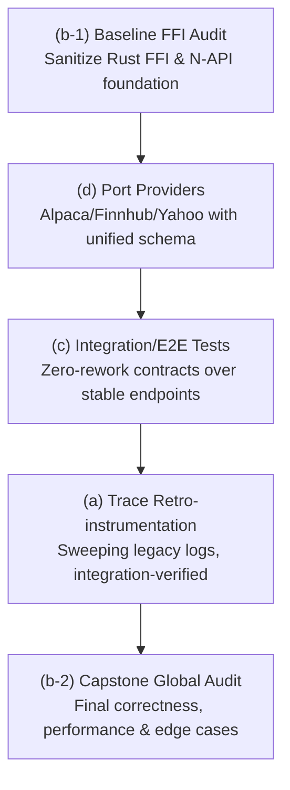

# Antigravity → Claude — Review & Design Record

This is the **durable, committed** record of Antigravity's review and design-partner findings for the
corelib monorepo. Antigravity writes one dated section per handoff here (and **never edits source**).
The bridge (`delegate_to_antigravity`) merges sections back on this tracked file; the manual relay
appends to it directly. See `AGENTS.md` → "Working with Antigravity (agy)".

<!-- New sections are appended below, newest last. Format: "## YYYY-MM-DD — <topic>". -->

## 2026-06-12 — Integration-test tier (divergent design pass)

### 1. Critical Review

This review analyzes the exhaustive integration test tier proposed for the corelib monorepo. Severity is calibrated to a pre-implementation design phase, where a **Blocker** indicates an architectural flaw that would force a costly rewrite if coded as-is.

#### 🔴 Blocker — Environment and Runtime Conflict in a Single Global Config
*   **Design Area**: Single root config [vitest.integration.config.ts](file:///C:/Users/user/Development/Node/corelib/.agent/worktrees/task-e0edda05/vitest.integration.config.ts)
*   **Verification**: [VERIFIED]
*   **Issue**: Running all integration tests under a single root config is architecturally incompatible.
    *   `ts-core` and its FFI tests require a standard **Node.js** environment to dynamically load native binaries (`corelib-rust.node`) using `createRequire` ([ts-core/src/core/index.ts](file:///C:/Users/user/Development/Node/corelib/.agent/worktrees/task-e0edda05/ts-core/src/core/index.ts#L8-L42)).
    *   `ts-cloud` tests must run in the specialized Cloudflare Worker pool ([@cloudflare/vitest-pool-workers](file:///C:/Users/user/Development/Node/corelib/.agent/worktrees/task-e0edda05/ts-cloud/vitest.config.ts#L5-L7)) which boots a specialized `workerd` V8 isolate sandbox. Under this sandbox, raw Node-native Dynamic loading of `.node` addons is completely unsupported.
    *   `ts-markets` environment defaults to `happy-dom` ([ts-markets/vitest.config.ts](file:///C:/Users/user/Development/Node/corelib/.agent/worktrees/task-e0edda05/ts-markets/vitest.config.ts#L5)).
    *   Combining these into a single execution config would either crash the FFI initialization, mock out necessary worker globals, or force a compromise where tests run outside their true target runtime.
*   **Concrete Fix**: Adopt **F1: PER-PACKAGE tests/integration/ trees**. Configure a localized integration config in each package (e.g., `ts-cloud/vitest.integration.config.ts` extending the local wrangler-pool configuration; `ts-core/vitest.integration.config.ts` running in raw Node). These can still be cleanly executed from the repository root via monorepo filtering (e.g., `pnpm --filter "./ts-*" test:integration`).

#### 🔴 Blocker — MSW Cannot Intercept FFI / Native Network Traffic
*   **Design Area**: MSW record/replay harness ([tests/integration/_harness/](file:///C:/Users/user/Development/Node/corelib/.agent/worktrees/task-e0edda05/tests/integration/_harness/))
*   **Verification**: [VERIFIED]
*   **Issue**: The design relies on MSW's `setupServer` to record and replay external interactions for FFI-based components (like `AlpacaStreaming` utilizing `coreFFI` native streams). MSW intercepts HTTP and WebSockets at the Node.js V8 JS layer (by monkeypatching global hooks such as `fetch` and `http.ClientRequest`). However, the Rust FFI binary compiles to raw assembly and drives its own network system calls via native crates (e.g., socket APIs, TCP client implementations). These native calls block and transmit completely outside the JS runtime's network hooks, bypassing MSW entirely. Recording or replaying FFI streams via MSW will result in silent misses and real-world connection attempts, rendering the integration tier non-deterministic.
*   **Concrete Fix**: During integration testing, run a custom **local mock loopback server** in JavaScript (Node lifecycle-bound, e.g., using `ws` and a minimal HTTP listener). Configure the FFI initialization payload ([AlpacaStreaming.ts:L58-L60](file:///C:/Users/user/Development/Node/corelib/.agent/worktrees/task-e0edda05/ts-markets/src/nasdaq/datafeeds/streaming/alpaca/AlpacaStreaming.ts#L58-L60)) with a custom target boundary (e.g., `baseUrl: "http://localhost:<freePort>"`) to force the native Rust runtime to hook into our local loopback server, which serves mock frames from our recorded fixtures.

#### 🔴 Blocker — Cloudflare Workers Local Database and File Sandbox Incompatibility
*   **Design Area**: SQLite tests with `createDatabase` against real SQLite files in temp directories
*   **Verification**: [VERIFIED]
*   **Issue**: The design plans to test database routers under `ts-cloud` against real local SQLite databases inside the `getTempDir` environment. However, when run under the `@cloudflare/vitest-pool-workers` environment, the V8 sandboxed worker does not allow arbitrary filesystem writes. Traditional SQLite file drivers ([@libsql/client](file:///C:/Users/user/Development/Node/corelib/.agent/worktrees/task-e0edda05/ts-core/src/database/sqlite/sqlite-driver.ts#L37-L38)) using standard filesystem paths (like `file:local.db`) will fail or crash immediately upon initialization inside Cloudflare's runtime due to sandboxed import limits and the absence of native filesystem access.
*   **Concrete Fix**: Shift SqlCloud/database integration coverage into Node-compatible test projects. Because Hono routers are platform-agnostic, you can safely test the endpoint's database composition inside standard Node (using `app.request` inside a Node vitest thread) where write-access to real SQLite databases is clean. Limit the edge-worker test boundaries to remote network proxies, or stub DB interactions with in-memory SQLite mocks mimicking Cloudflare D1.

#### 🟡 Should-Fix — Secrets Leakage in Recorded Fixtures
*   **Design Area**: Record fixtures under `_contracts/`
*   **Verification**: [VERIFIED]
*   **Issue**: Running `INTEGRATION_RECORD=1` against production endpoints like Alpaca, Nasdaq, or Yahoo will serialise raw request/response objects directly into committed JSON files. This will immediately leak highly sensitive API keys (e.g., Alpaca `APCA-API-KEY-ID`, `APCA-API-SECRET-KEY`), session credentials, authorization headers, and cookie headers.
*   **Concrete Fix**: The record/replay handler in `_harness/` must run a strict sanitization pass on the captured contract responses before they are serialized to disk. Create an array of sensitive header names and replace their matching values with `<REDACTED>` placeholder strings.

#### 🟡 Should-Fix — "White-Box Against Source" Bypasses Real Bundling Issues
*   **Design Area**: Source routing via `tsconfig` path aliases
*   **Verification**: [THEORETICAL]
*   **Issue**: While mapping `@ckir/*` directly to TypeScript source files is convenient and fast, it completely bypasses the compilation boundaries. If there are ESM/CJS interop issues, invalid `.js` import extensions, bundling bugs inside `tsup.config`, or missing peer dependencies, the integration tests will pass on source files but crash when the distributed package is actually loaded by a consumer.
*   **Concrete Fix**: The integration tests should run directly against the built `.tgz` packages or local workspace distributions in `dist/`, rather than using tsconfig source paths. Enforce that integration tests are preceded by a complete `build-all` operation.

#### 🟢 Nit — Non-Determinism in Streaming (WS) and Time/Cron Tests
*   **Design Area**: High-frequency streaming feeds and timers
*   **Verification**: [THEORETICAL]
*   **Issue**: Websocket streaming tests can easily hang or timeout in CI if network connectivity drifts or connections are left open. Cron tests that rely on real-time ticking make the test suite slow and brittle.
*   **Concrete Fix**: Expose a hard, tight timeout (e.g., `1000ms`) on every streaming websocket test. For Cron tasks, parameterize or subclass the time provider to allow fake timer injection or manual tick-execution instead of letting integration tests block waiting for physical clocks.

---

### 2. Creative Improvements

*   **A Unified Node.js Mock Loopback Server**: Instead of maintaining separate REST MSW listeners and custom socket stubs, implement a simple Node loopback server (using standard Node `net` and `http` APIs) that can boot dynamically on a free port. Both REST requests (`ky`) and FFI Websocket clients can point to this loopback using custom environment variables (e.g. `NASDAQ_API_URL=http://localhost:<port>`). This solves the FFI MSW interception issue, maintains zero-dependencies inside Cloudflare sandboxes, and unifies mocking under a single, highly performant contract-replay engine.
*   **Statical Permutation Validator**: To ensure your integration suite is truly "exhaustive" without becoming brittle, write a small structural schema validator script. This script compares our committed contracts matrix (success, 500, retry, 404) against a master JSON schema file of expected seams. If any API endpoint or FFI method lacks a corresponding record fixture in git, the validation script warns or fails, making exhaustiveness statically measurable.
*   **FFI Platform Graceful Degradation in Local Dev**: In local development, developers on unsupported configurations or without built binaries might face failure. The test runner should use `isFfiAvailable()` to skip native tests, but print a clear yellow diagnostic listing the missing platforms to prevent silent test skips that hide critical regressions.

---

### 3. Open Forks Analysis & Recommendations

#### F1: ONE root tests/integration/ tree vs PER-PACKAGE tests/integration/ trees
*   **Recommendation**: **PER-PACKAGE tests/integration/ trees** (e.g., `ts-core/tests/integration/`, `ts-cloud/tests/integration/`, etc.) but driven from a unified root command.
*   **Reasoning**: A single global tree forces a "lowest common denominator" configuration. It pollutes `tsconfig` configurations, causes type-pollution errors, and crashes due to runtime isolation conflicts (Sandboxed Workers vs raw FFI-compatible Node). Segmenting the design per-package keeps test configuration directly tied to each package's runtime environment (Wrangler vs Node), ensuring high safety and clean workspace resolutions.

#### F2: COMMIT recorded contract fixtures to the repo vs generate/cache them out-of-band
*   **Recommendation**: **COMMIT recorded contract fixtures to the repo** (incorporating strict pre-commit schema and secret checks).
*   **Reasoning**: Committing fixtures guarantees 100% offline-determinism, enabling immediate PR runs and eliminating complex external cache-provider dependencies in CI pipelines. However, this must be paired with an automated nightly workflow triggering `INTEGRATION_LIVE=1` to run the active live tier. This catches schema/domain drifts from original providers and updates the files, avoiding the problem of stale mocked pass patterns.

---

### 4. Highest Conviction Suggestion

**Implement a localized Loopback Mock Server bound to the Node integration lifecycle.**

By deploying a tiny, zero-dependency Node.js loopback broker during integration setup, we resolve MSW's inability to intercept compiled FFI Rust network calls, bypass filesystem boundaries in sandboxed environments, and enjoy a unified REST-and-Websocket contract-replay framework that holds dev-to-test parity across TypeScript and Rust.

---

## 2026-06-12 — Integration-test tier (spec-phase divergent pass)

### 1. Critical Review

This review performs a spec-phase pressure-test on the committed Integration Test Tier Design Spec, hunting for underspecified mechanics, gaps, ambiguity, and missing requirements that would derail the implementation plan or force mid-build rework.

#### 🔴 Blocker — Commander CLI Parsing Clashes with Vitest CLI Args
*   **Design Area**: [ConfigManager.ts](file:///C:/Users/user/Development/Node/corelib/.agent/worktrees/task-4023a505/ts-core/src/configs/ConfigManager.ts#L160-L190), §4.2 Root driver, §4.3 Shared harness
*   **Verification**: [VERIFIED]
*   **Issue**: `ConfigManager.initialize()` uses commander to parse `process.argv` looking for `-C` or `--config` to load external on-demand configurations. However, Vitest executes tests with CLI arguments that include its own configuration paths, such as `--config vitest.integration.config.ts`. If an integration test or the shared harness calls `ConfigManager.initialize()` during setup, `ConfigManager` will intercept Vitest's typescript config path, treat it as a JSON config file path, attempt to fetch/parse it as JSON, and crash the process.
*   **Concrete Fix**: Modify `ConfigManager.initialize()` to accept an optional argument: `public async initialize(args?: string[]): Promise<void>` and use `args ?? process.argv.slice(2)` for commander parsing. The integration test setup/harness can then safely invoke `await ConfigManager.getInstance().initialize([])`, bypassing commander's search of `process.argv` and avoiding the CLI flag collision entirely.

#### 🟡 Should-Fix — TS Path-Alias Pollution Risk in Production Bundles
*   **Design Area**: [tsup.config.ts](file:///C:/Users/user/Development/Node/corelib/.agent/worktrees/task-4023a505/ts-core/tsup.config.ts#L1-L25), [tsconfig.base.json](file:///C:/Users/user/Development/Node/corelib/.agent/worktrees/task-4023a505/tsconfig.base.json), §4.3 Shared Harness, §9 Directory Layout
*   **Verification**: [VERIFIED]
*   **Issue**: Adding `@itest/*` path mappings to `tsconfig.base.json` exposes them to all files inside `src/`. If a developer accidentally imports an integration helper (e.g. via IDE auto-complete) in production code, `tsup` will compile and build the test harness code directly into the production bundle at `dist/` (since `@itest` is not declared external in `tsup.config.ts`). This leads to severe bundle bloat, leaking test code, or build failures due to test-only Node imports like `msw` or `workerd` runtimes.
*   **Concrete Fix**: Remove `@itest/*` from `tsconfig.base.json` and package-level `tsconfig.json` files. Create a separate `tsconfig.integration.json` extending the base config, which includes `tests/integration/` and defines the `@itest/*` path mappings. In the vitest configs, map `@itest/*` directly inside `resolve.alias` to isolate it strictly to test execution.

#### 🟡 Should-Fix — State-Dependent and Sequential Mocking in Replay Mode
*   **Design Area**: [RequestUnlimited.ts](file:///C:/Users/user/Development/Node/corelib/.agent/worktrees/task-4023a505/ts-core/src/retrieve/RequestUnlimited.ts#L41-L54), §6 Replay Contract Harness, §6.2 Fixture Format
*   **Verification**: [VERIFIED]
*   **Issue**: Resilient HTTP calls via `RequestUnlimited` utilize retry logic (up to 5 retries with backoff limits). Standard MSW intercepts requests with one-to-one static mapping. If a test verifies "timeout -> retry -> success", a static fixture returned by URL/method will always return the same result (fail/success) for every retry attempt. Additionally, if an endpoint fails, the test will retry 5 times with backoffs up to 3000ms, stalling the Vitest thread.
*   **Concrete Fix**: (1) The mock record/replay player in `_harness/` must support stateful, sequential response queues (where requests to the same URL return the next response in an array of fixtures) to test retry flows. (2) Integration tests should configure a lower retry limit (e.g. `limit: 1`) via `ConfigManager` overrides during failure/timeout tests to prevent CI threads from stalling.

#### 🟡 Should-Fix — Credentials Leakage in Request & Response Bodies
*   **Design Area**: [AlpacaStreaming.ts](file:///C:/Users/user/Development/Node/corelib/.agent/worktrees/task-4023a505/ts-markets/src/nasdaq/datafeeds/streaming/alpaca/AlpacaStreaming.ts#L58-L76), §6.1 Secret Scrubbing
*   **Verification**: [VERIFIED]
*   **Issue**: §6.1 specifies scrubbing headers and query parameter values. However, some providers (like Alpaca streaming/REST or other brokers) can transit API keys or tokens in request bodies (e.g. POST payload JSON) or response bodies. Storing these bodies verbatim under `_contracts/` will leak sensitive credentials directly into git.
*   **Concrete Fix**: Extend §6.1 to require scrubbing of request and response **bodies**. The record handler should deserialize stringified bodies, recursively redact keys matching the denylist patterns (e.g., `keyId`, `secretKey`, `token`), and serialize the scrubbed payload back.

#### 🟢 Nit — Version Invariant Divergence Safeguard
*   **Design Area**: §5.3 FFI Version Assertion, [lib.rs](file:///C:/Users/user/Development/Node/corelib/.agent/worktrees/task-4023a505/rust/src/lib.rs#L52-L55)
*   **Verification**: [VERIFIED]
*   **Issue**: The spec requires that FFI-scalar tests assert `getVersion()` matches the "crate/package version" deterministically. While `Cargo.toml` and `ts-core/package.json` are currently matched at `0.1.17`, there is no automatic system ensuring they stay in sync, which could flag false positives on release runs.
*   **Concrete Fix**: Within the test assertion, load `ts-core/package.json` and compare `getVersion()` directly to that JSON's compiled `.version` string, asserting monorepo build synchronization explicitly.

#### 🟢 Nit — Ambiguity In Seam Matrix-To-Fixture Mapping
*   **Design Area**: §8 Coverage Matrix & Validator
*   **Verification**: [THEORETICAL]
*   **Issue**: How the `coverage.matrix.ts` maps matrix cells to file paths has no explicit schema, making it potentially ambiguous for `coverage-validator.ts`.
*   **Concrete Fix**: Define `SeamCell` interface in `tests/integration/coverage.matrix.ts` with explicit `fixturePath` pointing to `_contracts/**/*.json`, allowing static analysis to confidently map and orphan-scan.

---

### 2. Creative Improvements

*   **Dry-Run Verification of Contract Redaction**: In `INTEGRATION_RECORD` mode, the recorder should perform a dry-run comparison. It logs a unified diff of the raw vs scrubbed response object directly to the developer console. This gives the developer instant visual feedback on what secrets were identified and redacted before committing any contract fixtures.
*   **Test-Suite Temp Directory and Database Context Isolation**: Since Vitest executes tests in parallel, shared resource files can lead to read/write collisions on SQLite databases. The shared harness `_harness/` should expose helpers:
    1. `getTestTempDir()`: retrieves a randomized isolated temp directory;
    2. `createTestDatabase()`: spawns isolated sqlite instances;
    3. Global teardown registering cleanup hooks to recursively prune temp directories and close db connections, maintaining flawless open-handle hygiene.

---

### 3. Final Recommendation

**[Verified Clean] with Blocker and Should-Fix adjustments.** The specification is exceptionally cohesive, well-researched, and highly implementable. 

Our single highest-conviction suggestion is to **augment the ConfigManager API to accept explicit arguments** to prevent CLI option clashes under Vitest, and to **strictify the secret scrubber to intercept JSON bodies**.

---

## 2026-06-12 — Roadmap sequencing of 4 subprojects (divergent)

### 1. Critical Review of Candidate Roadmaps

#### 1.1 The User's Sequence: `a → b → c → d`
*   **Severe E2E Rework Risk (Undertesting & Rework Blockers)**: Writing integration/E2E tests (c) before porting the unified provider surface (d) is an anti-pattern. Porting providers from `finstream` introduces a unified TS/Rust schema and adds **Finnhub**. Writing MSW contract fixtures and testing streams over the *old* endpoints means a complete rewrite of the replay contracts in `tests/integration/_contracts/` immediately after (d) is completed.
*   **Swapping Safety Nets (Refactoring with No Test Coverage)**: Retro-instrumenting legacy modules (a) with trace/debug logging is a large, sweeping operation touching many files. Running this before establishing (c) means we have no integration safety net to guard against runtime typos, circular references in error serialization, or initialization crashes of child loggers.
*   **Premature Global Audit**: Conducting a deep code review (b) before (d) means the largest and most complex chunk of newly modified content (the multi-provider Rust WebSocket engine) entirely escapes global auditing.

#### 1.2 Claude's Recommendation Sequence: `a → d → c → b`
*   **Sound Progress**: Claude correctly identified the tension between (c) and (d), placing the provider porting (d) before E2E testing (c) to ensure tests cover the final, stable schemas and endpoints, preventing throwing away test code.
*   **The Unshielded Refactoring Flaw**: Claude's order still places the sweeping, legacy-wide trace retro-instrumentation (a) *first*. This is a high-risk refactoring phase done without an integration test tier. A single invalid child logger signature or bad parameter serialization in a core database/network path will bypass unit mocks and crash the production system.
*   **FFI Base Instability (Garbage In, Voyage Out)**: Porting finstream's highly asynchronous, multi-threaded WebSocket providers into `corelib-rust` (d) before verifying the core FFI napi/Rust execution engine via a baseline audit (b) introduces a massive risk of compounding memory leaks, resource exhaustion, or unhandled tokio runtime panics.

### 2. Creative Improvements & Split/Merge Analysis

*   **Split the Global Audit (b-1 & b-2)**: Rather than doing one massive audit, split it:
    *   **`(b-1) Baseline FFI Audit`**: A highly focused, surgical audit of the pre-existing FFI bridge, N-API rust boundaries, and the shared test harness setup. We clean up the foundation before building heavy real-time data ingestion models.
    *   **`(b-2) Capstone Global Audit`**: A complete, high-level product correctness and architectural review at the post-integration, post-trace final stage.
*   **Leverage the Standing Mandate (§12 "Debug & Trace Logging" of [AGENTS.md](file:///C:/Users/user/Development/Node/corelib/.agent/worktrees/task-b63f1108/AGENTS.md#L190-L218))**: New code is self-instrumented "at birth". By porting providers (d) *before* doing retro-instrumentation (a), all ported providers are written directly with proper trace/debug logging, eliminating duplicated refactoring loops on those modules.
*   **Use Integration Tests (c) as the Logging Safety Net**: By implementing the integration/E2E tier (c) *before* legacy retro-instrumentation (a), we gain a repeatable contract-replay harness. Any subsequent sweeping logging modifications to `ts-core` can be verified in milliseconds, turning a manual, high-risk refactor into a safe, automated pass.

### 3. Final Recommendation: Proposed Roadmap Sequence

We recommend a specialized split-and-staged roadmap that maximizes safety and eliminates throwaway contract work:

#### The Sequence: `b-1 → d → c → a → b-2`

1.  **`(b-1) Baseline FFI Audit`**: Sanitizes the underlying Rust N-API/FFI execution model and async runtime pool, ensuring a rock-solid, non-leaking native core before porting.
2.  **`(d) Port Providers`**: Ports Yahoo/Alpaca/Finnhub into the audited FFI, unified under a standard provider schema, self-instrumented at birth per §12.
3.  **`(c) Integration/E2E Tests`**: Implements the exhaustive integration suite over the finalized and stable provider endpoints, avoiding costly contract rework.
4.  **`(a) Trace Retro-instrumentation`**: Retro-instruments legacy modules with extensive logs, utilizing the newly built test suite (c) as a real-world runtime safety net.
5.  **`(b-2) Capstone Global Audit`**: Conducts the ultimate global architectural and edge-case correctness review over a complete, tested, and high-visibility monorepo.

---

## 2026-06-12 — (b-1) Baseline FFI/N-API audit

### 1. Critical Review

This section presents a baseline safety, lifecycle, and resource-teardown audit of the pre-existing FFI bridge, N-API rust boundaries, and async WebSocket streaming runtimes before porting the finstream providers (d).

#### 🔴 Blocker — Perpetual Background Task & Socket Leak on Javascript Garbage Collection
*   **Design Area**: `AlpacaStreamingCore::start()` ([alpaca_streamer.rs:L234-L237](file:///C:/Users/user/Development/Node/corelib/.agent/worktrees/task-b2b76043/rust/src/markets/nasdaq/datafeeds/streaming/alpaca/alpaca_streamer.rs#L234-L237)) & `YahooStreamingCore::start()` ([yahoo_streamer.rs:L231-L234](file:///C:/Users/user/Development/Node/corelib/.agent/worktrees/task-b2b76043/rust/src/markets/nasdaq/datafeeds/streaming/yahoo/yahoo_streamer.rs#L231-L234)).
*   **Verification**: [VERIFIED]
*   **Issue**: Long-running background supervisor loops are spawned using `tokio::spawn(Self::run_loop(Arc::clone(&inner), ...))`, capturing a strong owned `Arc` reference to the core streamer instance. When JavaScript drops/GCs the `AlpacaStreaming` or `YahooStreaming` instance without calling `.stop()`, the Rust struct is freed by V8 but the underlying struct destructor is never completed because its strong `Arc` count remains $\ge 1$ inside the Tokio pool. Sockets, pings, background timers, and the threadsafe-functions (TSFNs) survive and reconnect indefinitely, leaking heavy platform resources.
*   **Concrete Fix**: [Surgical] Implement the `Drop` trait for the public FFI structs (`AlpacaStreaming`/`YahooStreaming`) to explicitly trigger graceful teardown (`core.stop()`) on GC drop. Alternatively, move task state to a weak-reference pattern (`Arc::downgrade`) inside the supervisor loop, terminating the loop once the upgrading weak reference fails.

#### 🔴 Blocker — Sticky Exponential Backoff Locks Reconnect Loop at 1 Hour
*   **Design Area**: `alpaca_streamer.rs:L240-L284` ([alpaca_streamer.rs:L240-L284](file:///C:/Users/user/Development/Node/corelib/.agent/worktrees/task-b2b76043/rust/src/markets/nasdaq/datafeeds/streaming/alpaca/alpaca_streamer.rs#L240-L284)) & `yahoo_streamer.rs:L236-L269` ([yahoo_streamer.rs:L236-L269](file:///C:/Users/user/Development/Node/corelib/.agent/worktrees/task-b2b76043/rust/src/markets/nasdaq/datafeeds/streaming/yahoo/yahoo_streamer.rs#L236-L269)).
*   **Verification**: [VERIFIED]
*   **Issue**: Reconnection interval `backoff` is initialized at 5 seconds and doubles on every iteration, capped at 1 hour (3600 seconds). However, **the backoff duration state is never reset** once a connection is successfully established. If a stream has a long outage and reaches a high backoff value, the subsequent successful reconnection retains that backoff state. The very next minor disconnect will wait for the high sticky backoff time (up to 1 hour) before attempting to reconnect, breaking client stream self-healing.
*   **Concrete Fix**: [Surgical] Restructure `run_loop` to reset the `backoff` to its base value (e.g., 5 seconds) whenever the underlying `ws_loop` succeeds, authenticates, and receives its first data frames.

#### 🔴 Blocker — Synchronous Redb Multi-File Lock Prevents Concurrent Streams
*   **Design Area**: `AlpacaStreamingCore::new()` ([alpaca_streamer.rs:L147-L182](file:///C:/Users/user/Development/Node/corelib/.agent/worktrees/task-b2b76043/rust/src/markets/nasdaq/datafeeds/streaming/alpaca/alpaca_streamer.rs#L147-L182)) & `YahooStreamingCore::new()` ([yahoo_streamer.rs:L154-L192](file:///C:/Users/user/Development/Node/corelib/.agent/worktrees/task-b2b76043/rust/src/markets/nasdaq/datafeeds/streaming/yahoo/yahoo_streamer.rs#L154-L192)).
*   **Verification**: [VERIFIED]
*   **Issue**: Constructors for both Alpaca and Yahoo streams synchronously initialize a local database using `Database::create(&db_env)`. By default, they resolve to static global filenames (`corelib_streaming.redb` and `yahoo_streaming.redb`) under the system temp directory. Because `redb` enforces exclusive single-writer file locking on open, **creating a second instance of the same streaming provider (or initializing multiple concurrent feeds) will panic or freeze the entire process** during construction.
*   **Concrete Fix**: [Surgical] Randomized or uniqueify persistent db file names per instance (e.g. including instance UUID/PID) or provide a fallback to opt-out of local persistence database writes completely (such as passing `"NOT_SET"` to run fully in-memory).

#### 🟡 Should-Fix — Synchronous Disk I/O Blocking the JS Event Loop
*   **Design Area**: `AlpacaStreamingCore::new()` ([alpaca_streamer.rs:L159](file:///C:/Users/user/Development/Node/corelib/.agent/worktrees/task-b2b76043/rust/src/markets/nasdaq/datafeeds/streaming/alpaca/alpaca_streamer.rs#L159)) & `YahooStreamingCore::new()` ([yahoo_streamer.rs:L168](file:///C:/Users/user/Development/Node/corelib/.agent/worktrees/task-b2b76043/rust/src/markets/nasdaq/datafeeds/streaming/yahoo/yahoo_streamer.rs#L168)).
*   **Verification**: [VERIFIED]
*   **Issue**: Calling `Database::create` inside the synchronous constructor blocks V8's main thread with synchronous file creation and transactional I/O. Any disk delay directly lags the single-threaded JS event loop.
*   **Concrete Fix**: [Surgical] Shift database creation and pre-loaded subscription tasks out of the synchronous constructor and into the asynchronous `init()` method.

#### 🟡 Should-Fix — Stderr-Only Crash Propagation on Task Panics
*   **Design Area**: `AlpacaStreamingCore::run_loop` ([alpaca_streamer.rs:L235](file:///C:/Users/user/Development/Node/corelib/.agent/worktrees/task-b2b76043/rust/src/markets/nasdaq/datafeeds/streaming/alpaca/alpaca_streamer.rs#L235)).
*   **Verification**: [VERIFIED]
*   **Issue**: Unhandled panics in database operations (such as unwrap on corrupt tables, database write-lock contention, or file permission crashes) unwind inside Tokio, silently killing the supervisor loop. The Javascript wrapper is never notified and continues waiting on a dead stream.
*   **Concrete Fix**: [Surgical] Wrap the worker thread closure using `catch_unwind` or monitor the task's `JoinHandle` to propagate execution state crashes cleanly as JS errors or `on_event("error")` callbacks.

#### 🟡 Should-Fix — Plaintext Secrets Exposure via Primitive Debug Derives
*   **Design Area**: `AlpacaConfig` ([alpaca_streamer.rs:L35-L48](file:///C:/Users/user/Development/Node/corelib/.agent/worktrees/task-b2b76043/rust/src/markets/nasdaq/datafeeds/streaming/alpaca/alpaca_streamer.rs#L35-L48)).
*   **Verification**: [VERIFIED]
*   **Issue**: `AlpacaConfig` derives a basic `Debug` trait. Sensitive API tokens and credentials (`key_id`, `secret_key`) are fully readable. Normal logging statements (e.g. `log.debug!("{:?}", config)`) or assertions will write plaintext passwords directly into rotating log files.
*   **Concrete Fix**: [Surgical] Formally implement a custom `Debug` trait for `AlpacaConfig` that intercepts and masks private credential fields.

#### 🟢 Nit — Lack of Jitter on Reconnection Backoff
*   **Design Area**: `alpaca_streamer.rs:L279` ([alpaca_streamer.rs:L279](file:///C:/Users/user/Development/Node/corelib/.agent/worktrees/task-b2b76043/rust/src/markets/nasdaq/datafeeds/streaming/alpaca/alpaca_streamer.rs#L279)) & `yahoo_streamer.rs:L265` ([yahoo_streamer.rs:L265](file:///C:/Users/user/Development/Node/corelib/.agent/worktrees/task-b2b76043/rust/src/markets/nasdaq/datafeeds/streaming/yahoo/yahoo_streamer.rs#L265)).
*   **Verification**: [VERIFIED]
*   **Issue**: Sleep times are strictly deterministic. In high-concurrency provider workloads (d), simultaneous disconnections will trigger synchronized attempts back onto the provider with no random variance, risking systematic rate limits or DDoS flags.
*   **Concrete Fix**: [Surgical] Introduce randomised millisecond jitter inside the reconnection sleep delay.

---

### 2. Creative Improvements

*   **Define a Unified `StreamingProvider` Lifecycle Trait**:
    To eliminate code duplication across the separate Alpaca and Yahoo streamers during subproject (d), introduce a shared `StreamingProvider` engine. By genericizing WebSocket connections, keep-alive ping loops, silence-reconnect timers, error handling states, and channel dispatches inside a standard Rust trait wrapper, developers can deploy any new provider (like Finnhub or others) cleanly by simply implementing parsing, authentication hooks, and endpoint definitions.
*   **Backpressure and Dynamic Flow Control**:
    High-frequency market feeds can choke V8 when dispatched using fully non-blocking TSFNs under market load. Establish queue limits or dynamic message grouping inside the FFI boundary. If the JS event processing loop falls behind, Rust can coalesce quote frames (retaining only the newest symbol price) to ensure memory consumption remains stable.

---

### 3. Highest Conviction Safety Suggestion

Our highest-conviction recommendation is to **implement custom Drop traits on the public napi wrappers and force a sticky-backoff reset parameter**. Ensuring clean task-aborting on GC prevent resource exhaustion under high instantiation, and resolving the backoff lock establishes self-healing connectivity.

