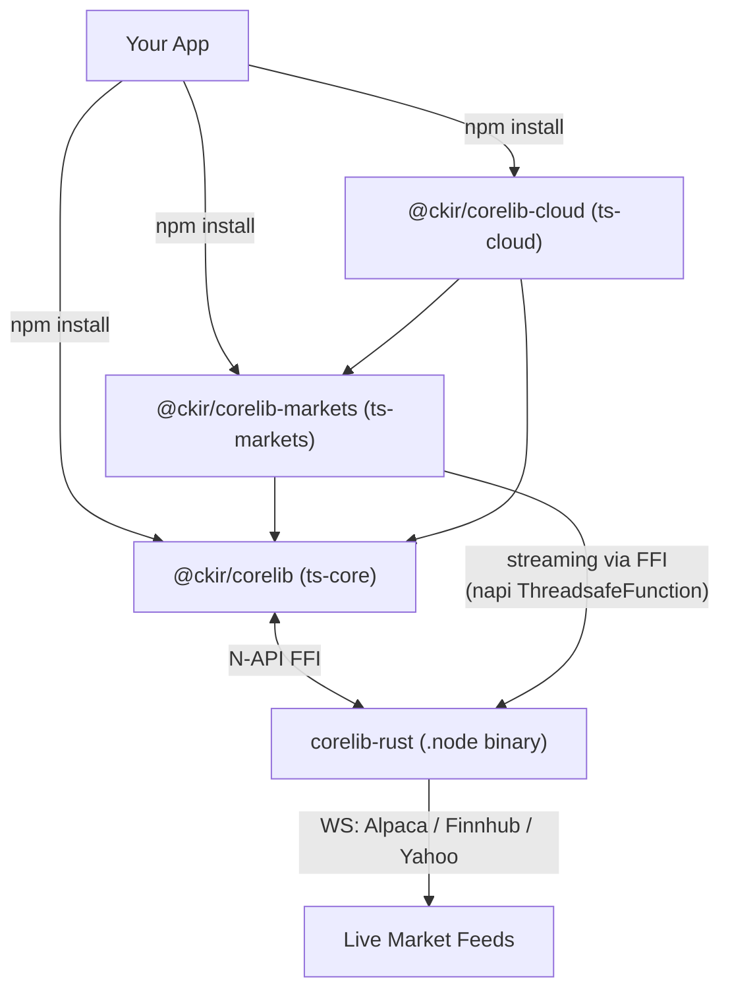

# Corelib Monorepo

A high-performance, resilient, and multi-runtime monorepo for TypeScript and Rust. This workspace provides foundational utilities, cloud extensions, and financial market tooling designed for **Node.js, Bun, and Deno**.

## 🚀 Overview

This repository is structured as a pnpm monorepo, integrating TypeScript's flexibility with Rust's performance through FFI (Foreign Function Interface). It is built on principles of resilience, performance, and cross-runtime compatibility.

### Key Features
- **Isomorphic Core**: All foundational utilities in `ts-core` support Node.js, Bun, and Deno.
- **Resilient HTTP**: Standardized fetch wrapper (`RequestUnlimited`) with automatic retries and consistent error serialization. `RequestProxied` extends this with self-healing, rotating proxy pools that automatically prune dead endpoints.
- **Strict Logging**: Structured logging API with `(msg: string, extras?: object)` signature and telemetry support.
- **Native Rust Performance**: Performance-critical paths (streaming engines, WS clients) implemented in Rust via N-API/FFI — zero JS event-loop blocking via napi worker threads.
- **Real-Time Streaming**: Live market data from Alpaca, Finnhub, and Yahoo Finance; the Rust engine owns the WebSocket, delivering data to JS as events via napi `ThreadsafeFunction`.
- **Unified Configuration**: Centralized `ConfigManager` supporting overrides via files, environment variables, and CLI.

---

## Architecture



---

## 📂 Project Structure & Packages

| Package | Description | Documentation |
| :--- | :--- | :--- |
| **[`@ckir/corelib`](./ts-core/README.md)** | Core logic, FFI bridge, resilient HTTP, and database abstractions. | [README](./ts-core/README.md) |
| **[`@ckir/corelib-markets`](./ts-markets/README.md)** | Market data tooling (Nasdaq, Yahoo) and financial indicators. | [README](./ts-markets/README.md) |
| **[`@ckir/corelib-cloud`](./ts-cloud/README.md)** | Cloud-specific extensions for AWS, GCP, and Cloudflare. | [README](./ts-cloud/README.md) |
| **[`corelib-rust`](./rust/README.md)** | Native Rust core exposed via N-API (FFI). | [README](./rust/README.md) |

---

## 📦 Installation for External Projects

These packages are published to the **public npm registry** under the `@ckir` scope.

### 1. Install
```bash
npm install @ckir/corelib @ckir/corelib-markets
# or: pnpm add @ckir/corelib @ckir/corelib-markets
# or: bun add  @ckir/corelib @ckir/corelib-markets
```

### 2. Required `.npmrc` (when using `@ckir/corelib-markets`)
`@ckir/corelib-markets` depends on `@gadicc/yahoo-finance2`, distributed via **JSR**. Add the JSR registry mapping to your project's `.npmrc`, or installs will 404 on the transitive `@jsr/...` package:
```
@jsr:registry=https://npm.jsr.io
```

### 🦀 The Native Rust Binary
`@ckir/corelib` ships a `postinstall` that downloads the correct prebuilt Rust binary (`corelib-rust-*.node`) for your OS/arch from the matching GitHub Release.

- **Supported targets:** `linux-x64`, `win32-x64`, `darwin-x64`, `darwin-arm64`. There is **no `linux-arm64`** build — Linux deployments must be x64 (e.g. not AWS Graviton / Ampere) until an arm64 binary is shipped.
- **Bun consumers:** Bun blocks dependency `postinstall` scripts by default. Add corelib to `trustedDependencies` in your `package.json`, or the binary is never fetched and the FFI fails at runtime:
  ```json
  "trustedDependencies": ["@ckir/corelib"]
  ```
- **`MODE=development` caveat:** the postinstall **skips** the download when `MODE=development` (or under CI's `GITHUB_ACTIONS`). Don't set `MODE=development` in a consuming app's `.env`, or you'll hit a "module not found" for the addon.
- **Manual trigger** if the download was skipped or blocked:
  ```bash
  node node_modules/@ckir/corelib/scripts/postinstall.js
  ```

---

## 🛠️ Getting Started

### Prerequisites
- [Node.js](https://nodejs.org/) (v24+ recommended)
- [pnpm](https://pnpm.io/) (v10+ required)
- [Rust](https://rust-lang.org/) (for native module builds)

### Common Commands
All workspace-wide commands are managed through `pnpm`:

| Command | Description |
| :--- | :--- |
| `pnpm install` | Install all dependencies and link packages |
| `pnpm build-all` | Build all packages in correct order |
| `pnpm test-all` | Run all unit and integration tests |
| `pnpm lint-all` | Run Biome linting and formatting checks |
| `pnpm format-all` | Apply Biome formatting automatically |
| `pnpm docs-all` | Regenerate all API documentation |
| `pnpm clean-all` | Wipe all `node_modules`, `dist`, and `target` folders |

---

## 📖 Usage Examples

### 1. Core Utilities (`@ckir/corelib`)
```typescript
import { logger, endPoint, RequestProxied, ConfigManager } from '@ckir/corelib';

// 1. Resilient Fetch (ky-powered with retries)
const result = await endPoint('https://api.nasdaq.com/api/market-info');

// 2. Proxied Fetch (Automatic rotation & fallback)
const client = new RequestProxied(["https://proxy1.com", "https://proxy2.com"]);
const proxiedResult = await client.endPoint("https://target.com");

// 3. Configuration Management
const config = ConfigManager.getInstance();
await config.initialize();              // single-flight; safe under concurrency
if (!config.isInitialized) await config.whenReady();
const port = config.get("database.port"); // read at the use site, don't cache slices
```

### 2. Market Data (`@ckir/corelib-markets`)
```typescript
import { MarketMonitor, MarketSymbols, Historical, type MarketPhase } from '@ckir/corelib-markets';

// 1. Resilient Status Poller
const monitor = new MarketMonitor();
monitor.on("status-change", (phase: MarketPhase) => {
  console.log(`Market phase changed to ${phase}`);
});
monitor.start();

// 2. Persistent Symbol Database
const symbols = new MarketSymbols();
const aapl = await symbols.get("AAPL"); // Auto-refreshes if needed

// 3. Resilient Historical Data (Yahoo Finance v3)
const history = await Historical.getData("AAPL", { period1: "2023-01-01" });
if (history.status === 'success') {
  console.log(`Retrieved ${history.value.length} quotes`);
}
```

### 2b. Real-Time Streaming (flagship — Rust WS engine, zero event-loop blocking)
```typescript
import { AlpacaStreaming } from '@ckir/corelib-markets';

const stream = new AlpacaStreaming();

// Credentials via init() or APCA_API_KEY_ID / APCA_API_SECRET_KEY env vars
await stream.init({ keyId: 'YOUR_KEY', secretKey: 'YOUR_SECRET' });
await stream.start();

stream.subscribe(['AAPL', 'TSLA', 'NVDA']);

stream.on('pricing', (data) => {
  console.log(`${data.symbol}: $${data.price}`);
});
stream.on('connected',    () => console.log('connected'));
stream.on('disconnected', () => console.log('disconnected'));
stream.on('error',        (e) => console.error('error', e));

// FinnhubStreaming and YahooStreaming follow the same EventEmitter pattern
// (Finnhub uses token auth; Yahoo is unauthenticated — see ts-markets/README.md)
```

### 3. Edge Proxy Services (`@ckir/corelib-cloud`)
A portable TypeScript service exposing corelib logic on **Cloudflare Workers**, **AWS Lambda**, and **Cloud Run**.

```bash
# Example: Fetching market data via the Edge Proxy
curl -X POST https://your-edge-service/api/v1/markets/nasdaq \
     -H "Content-Type: application/json" \
     -d '{
       "url": "https://api.nasdaq.com/api/quote/AAPL/info?assetclass=stocks"
     }'
```

---

## 📖 API Documentation

Detailed API documentation is generated for each package and published via GitHub Pages:

- **[Unified Documentation Index](https://ckir.github.io/corelib/index.html)**
- **[Core Utilities Documentation](https://ckir.github.io/corelib/ts-core/index.html)** (`@ckir/corelib`)
- **[Market Data Documentation](https://ckir.github.io/corelib/ts-markets/index.html)** (`@ckir/corelib-markets`)
- **[Cloud Extensions Documentation](https://ckir.github.io/corelib/ts-cloud/index.html)** (`@ckir/corelib-cloud`)
- **[Rust Native Core Documentation](https://ckir.github.io/corelib/rust/corelib_rust/index.html)** (`corelib-rust`)

---

## 📜 License

Refer to the [LICENSE](./LICENSE) file for details.
